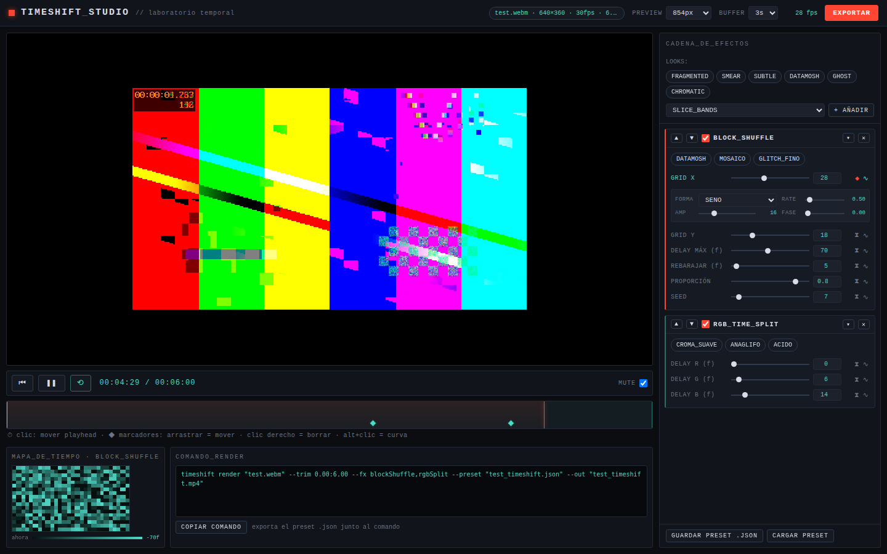
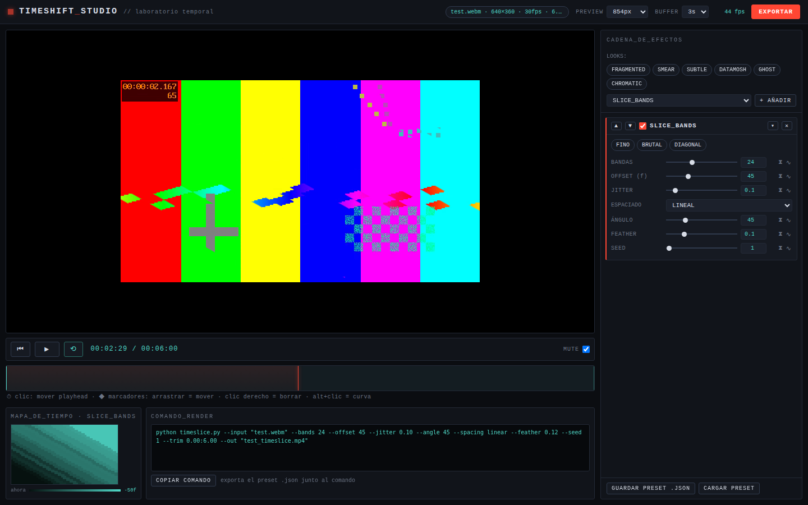
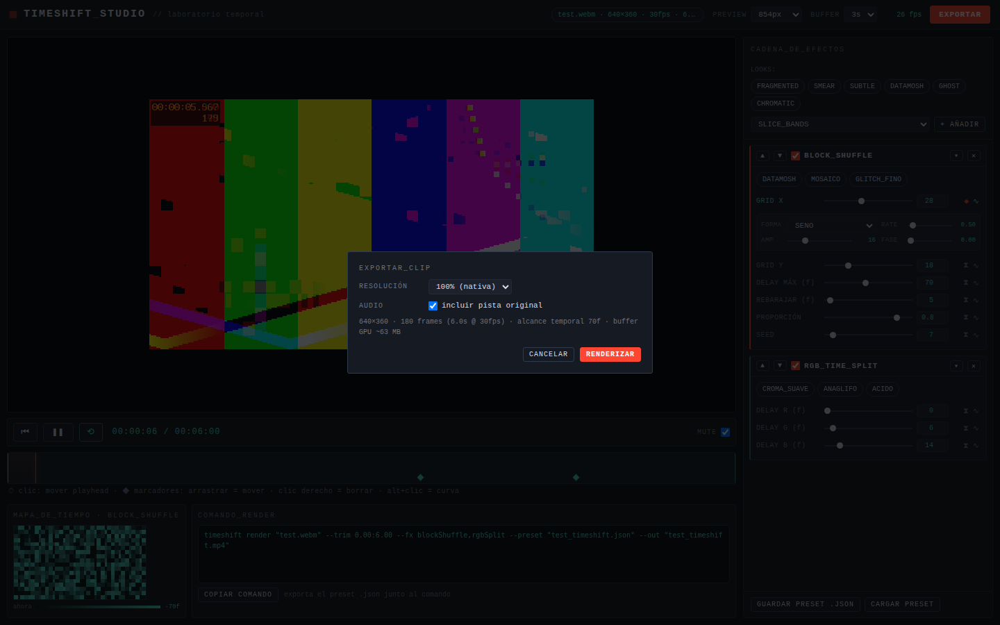

# TIMESHIFT_STUDIO

**Laboratorio de efectos temporales de video en tiempo real, para cineastas AI.**
Real-time temporal video effects lab for AI filmmakers — slit-scan, time
displacement, block shuffle, temporal echo, RGB time split and scan sweep,
running 100% client-side on WebGL2. No uploads, no server, no build step.



## Capturas / Screenshots

| Slit-scan diagonal + mapa de tiempo | Diálogo de export |
| --- | --- |
|  |  |

## Características / Features

- **Motor WebGL2** — el video decodificado alimenta un *ring buffer* de
  texturas (`TEXTURE_2D_ARRAY`); todos los efectos son fragment shaders que
  muestrean ese historial de frames. Memoria acotada y configurable
  (resolución de preview + segundos de buffer).
  *WebGL2 engine: decoded frames feed a texture ring buffer; every effect is
  a fragment shader sampling that frame history. Bounded, configurable memory.*
- **10 efectos apilables / 10 stackable effects** (cadena ordenada con
  ping-pong framebuffers, toggles por efecto):
  - `SLICE_BANDS` — slit-scan clásico: N bandas paralelas, cada una desde un
    frame distinto del pasado. Rotación libre 0–180°, espaciado lineal o
    aleatorio, jitter, feather con fusión alfa real, seed.
  - `TIME_DISPLACEMENT` — retraso por píxel guiado por un mapa de grises:
    gradiente, radial, ruido, ruido animado o **imagen propia**; escala,
    rotación e inversión del mapa.
  - `BLOCK_SHUFFLE` — cuadrícula de bloques congelados/retrasados al azar,
    rebarajados cada N frames (el look "datamosh UI").
  - `TEMPORAL_ECHO` — estelas de movimiento: N ecos con opacidad
    decreciente; fusión normal / screen / diferencia.
  - `RGB_TIME_SPLIT` — canales R, G y B muestreados en tres tiempos.
  - `SCAN_SWEEP` — una banda barre el encuadre; dentro, el tiempo se
    retrasa o se congela (rolling shutter como barrido visible).
  - `CELL_MAP` — la luminancia del propio video se convierte en remapeo
    temporal espacial sobre una cuadrícula (o por píxel), con
    posterización opcional. *Luminance becomes spatial time remapping.*
  - `PIXEL_SYNTH` — el brillo se convierte en composiciones de textura por
    capas: símbolos, ASCII o bloques por celda, con banda de luminancia
    (apila varias instancias para el look "pixelcrash") y tinta
    blanco/color fuente/sobre video. *Brightness → layered glyph textures.*
  - `VIENTO` — disolución direccional en partículas: smear por espacio y
    tiempo a lo largo del viento, con turbulencia y grano parpadeante.
    *Directional particle dissolution through space and time.*
  - `MOTION_TRACK` — dos trackers reales en un efecto.
    **AUTO**: sustracción de fondo (modelo EMA con actualización selectiva,
    así el sujeto nunca se aprende como fondo) → erosión/dilatación →
    regiones conectadas → asociación por posición predicha, con IDs
    estables, inercia y persistencia.
    **PUNTOS**: eliges tú qué seguir — clic en el visor y cada punto guarda
    un parche de luminancia normalizado que se re-localiza cada frame con
    búsqueda SAD gruesa-fina (tabla de sumas para la media, sesgo de
    proximidad contra texturas repetidas, radio que se ensancha tras un
    fallo y re-búsqueda global si se pierde). El clic se ancla solo al
    detalle con más contraste que haya cerca, el parche se adapta despacio
    y cada punto reporta su confianza.
    Se dibuja como overlay de laboratorio: cajas / esquinas / círculos /
    mirillas, estelas, IDs, líneas entre vecinos o vectores de velocidad y
    lecturas numéricas; se compone en shader y se exporta a resolución
    completa. *Two real trackers — background-subtraction auto detection and
    user-placed template points — rendered as a lab overlay, fully
    exportable.*
- **Animación de parámetros / Parameter animation** — todo parámetro
  numérico se anima por dos vías:
  - **LFO**: seno / triángulo / cuadrada / paso aleatorio, con rate,
    amplitud y fase, bloqueado al tiempo del clip (preview y export
    coinciden de forma determinista).
  - **Keyframes**: botón-reloj junto a cada slider para fijar un keyframe en
    el playhead; marcadores en el timeline (arrastrar = mover, clic derecho
    = borrar, alt+clic = cambiar curva linear/ease-in/out/in-out).
- **Mapa de tiempo en vivo / Live time-map** — visualización teal del campo
  de retraso por píxel del efecto seleccionado, calculada en CPU con los
  mismos hashes que el shader; se actualiza mientras los parámetros animan.
- **Export a resolución nativa / Full-resolution export** — re-decodifica la
  fuente en streaming (sin cargar el clip en memoria), renderiza cada frame
  con los parámetros animados evaluados por frame, codifica con **WebCodecs
  VideoEncoder** (H.264 → VP9 según soporte) y muxea a **MP4** con
  [mp4-muxer](https://github.com/Vanilagy/mp4-muxer) desde CDN. Audio
  original recortado y alineado (AAC u Opus). Barra de progreso y
  cancelación. *Fallback visible:* MediaRecorder → WebM en tiempo real si
  WebCodecs no está disponible.
- **Explorador de efectos con vista previa en vivo / Live effect browser** —
  `EXPLORAR EFECTOS…` abre una rejilla donde cada efecto y cada *look* se
  renderiza **sobre tu propio clip, en movimiento**: un segundo motor de
  384px con su propio ring buffer (alimentado de los frames que ya decodifica
  el motor principal, sin decodificar dos veces) va rotando entre las
  tarjetas, y la que tienes bajo el cursor se muestra grande junto a su
  descripción y sus presets — pasar por un preset lo previsualiza, hacer clic
  lo añade. Con filtro de texto. El clip **rueda mientras el explorador está
  abierto** (silenciado, con la posición y el estado de reproducción
  restaurados al cerrar): en un frame congelado casi todos los efectos
  temporales se ven iguales. Las tarjetas mantienen la forma del clip con
  letterbox, así que un vídeo vertical no deforma la rejilla ni tapa los
  nombres.
- **Timeline exacto al frame / Frame-accurate timeline** — un clic en
  cualquier punto del timeline salta al frame que contiene ese instante y
  reconstruye el buffer con los frames reales anteriores (sólo hasta donde
  la cadena mira, así es casi instantáneo): lo que ves en pausa es
  exactamente lo que se exporta. Avance frame a frame con `←/→` (shift = 10)
  o los botones ◀| |▶, contador de frame en el transporte y miniatura del
  frame bajo el cursor al pasar por el timeline.
- **Deshacer / rehacer** — `⌘/ctrl+Z` y `⌘/ctrl+⇧+Z` sobre toda la cadena:
  efectos añadidos o borrados, orden, activaciones, valores, LFOs, keyframes,
  puntos de trackeo y recorte. Las instantáneas se toman con *debounce*, así
  que arrastrar un slider queda como un solo paso, y conservan por referencia
  lo que JSON no puede guardar (una imagen de mapa subida). Dentro de un campo
  de texto el atajo sigue siendo el deshacer del navegador.
- **Presets** — chips por efecto, *looks* globales (`FRAGMENTED`, `SMEAR`,
  `SUBTLE`, `DATAMOSH`, `GHOST`, `CHROMATIC`, `TRACKER`, `PIXELCRASH`,
  `VENDAVAL`), y export/import del stack
  completo + animación como **.json** portable. Se conserva el patrón
  "copiar comando de render": cadenas de slit-scan puro generan un comando
  `timeslice.py` compatible con el prototipo CLI original.
- **Errores con contexto** — aviso cuando un delay supera el buffer (con
  máximo sugerido), detección de WebGL2 ausente, códecs no soportados,
  buffer recortado por memoria GPU.

## Uso / Usage

### ES

1. Sirve la carpeta (o abre `index.html` directamente):
   ```bash
   npx serve .
   ```
2. Arrastra un clip (mp4/webm/mov) al visor. Todo se procesa localmente.
3. Pulsa **EXPLORAR EFECTOS…** para ver todos los efectos y *looks*
   previsualizados en vivo sobre tu clip; clic en una tarjeta para añadirla.
   Reordena con ▲▼, activa/desactiva con el checkbox, pliega con ▾.
4. Anima: pulsa **⧗** junto a un slider para fijar keyframes en el playhead,
   o **∿** para abrir el LFO. Los marcadores viven en el timeline.
   `⌘/ctrl+Z` deshace cualquier cambio de la cadena (con `⇧`, rehace).
5. Recorta con los tiradores teal del timeline; el loop respeta el recorte.
   Clic en el timeline = ir a ese frame exacto; `←/→` avanza frame a frame.
   Para trackear, añade `MOTION_TRACK`, pulsa **ELEGIR PUNTOS EN EL VISOR** y
   haz clic sobre lo que quieras seguir.
6. **EXPORTAR** → elige escala y audio → **RENDERIZAR**. El MP4 se descarga
   al terminar. Guarda tu setup con **GUARDAR PRESET .JSON**.

### EN

1. Serve the folder (or just open `index.html`): `npx serve .`
2. Drag a clip (mp4/webm/mov) onto the viewport — everything stays local.
3. Hit **EXPLORAR EFECTOS…** for a grid of live previews of every effect and
   look running on your own clip; click a tile to add it. Reorder with ▲▼,
   toggle each effect, collapse cards.
4. Animate: hit **⧗** next to any slider to drop a keyframe at the playhead,
   or **∿** for the LFO editor. Keyframe markers live on the main timeline
   (drag to move, right-click to delete, alt+click cycles easing).
   `⌘/ctrl+Z` undoes any chain change (`⇧` to redo).
5. Trim with the teal timeline handles; looping respects the trim region.
   Clicking the timeline jumps to that exact frame; `←/→` steps frame by
   frame. To track something, add `MOTION_TRACK`, hit **ELEGIR PUNTOS EN EL
   VISOR** and click on your subject.
6. **EXPORTAR** → pick scale/audio → **RENDERIZAR**; the MP4 downloads when
   done. Save/load the whole setup as a JSON preset.

### Consejos de rendimiento / Performance notes

- Objetivo: 24fps+ de preview a ~0.4MP (854px) con 3 efectos apilados en GPU
  integrada. Si va justo, baja `PREVIEW` a 640px o reduce `BUFFER`.
- El alcance temporal máximo = frames del buffer. Sube `BUFFER` (2–8s) si un
  efecto avisa que su delay queda recortado.
- Al hacer scrub en pausa, el buffer se re-construye automáticamente con el
  historial real (indicador `RECONSTRUYENDO…`); sólo se rellenan los frames
  que la cadena activa realmente lee.
- El explorador de efectos sólo renderiza mientras está abierto, y a 384px.

## Arquitectura / Architecture

```
index.html            SPA sin build — ES modules
src/
  engine/             gl.js · ringbuffer.js (TEXTURE_2D_ARRAY) · renderer.js
                      (cadena ping-pong + prelude GLSL) · video.js (fps, seek)
  effects/            10 módulos shader + registry + looks (hot-swappable)
  animation/          lfo.js · keyframes.js · resolver.js (puro: (fx,t)→valores)
  export/             exporter.js (WebCodecs + mp4-muxer) · fallback.js (WebM)
  ui/                 transport (scrub exacto al frame, miniaturas) · browser
                      (rejilla con motor de preview propio) · trackpoints
                      (elegir puntos en el visor) · chain · anim · timemap
                      · presets · export · zoom · history (undo/redo) · toast
```

## Créditos e inspiración / Credits & inspiration

Este proyecto se apoya en la tradición del **slit-scan** y el **time
displacement**: de la fotografía de rendija y el *Stargate* de Douglas
Trumbull en *2001*, pasando por *Steina & Woody Vasulka*, los experimentos
de time-mapping de **Zbigniew Rybczyński**, hasta los efectos *Time
Displacement* de After Effects y los slit-scanners en Processing/openFrameworks
que popularizaron la técnica en tiempo real (véase la recopilación
["An Informal Catalogue of Slit-Scan Video Artworks"](https://www.flong.com/archive/texts/lists/slit_scan/index.html)
de Golan Levin).

La suite de efectos y el patrón de flujo preview→render están directamente
inspirados en el pack **TimeSlice-Nodes para ComfyUI** y en el prototipo
`timeslice_lab.html` / `timeslice.py` del que evoluciona esta app — de ahí el
comando de render compatible con `timeslice.py` para cadenas de slit-scan puro.

*Built on the slit-scan / time-displacement tradition — and inspired by the
TimeSlice-Nodes ComfyUI pack and the original timeslice CLI prototype this
app grew out of.*

## Licencia / License

[MIT](LICENSE)
